# Introducción

Este proyecto surge no sólo por el motivo que la materia presenta con el fin de poder presentar una solución, ya sea un bien o un servicio ante un problema o necesidad. Sino como un conjunto de necesidades tanto de a quién va destinado el uso de proyecto, sino como también necesidades personales de quien lo desarrolla a fin de poder adquirir nuevas habilidades para poder crecer tanto personal como profesionalmente.  
Es así como en el transcurso del desarrollo del proyecto, que comenzó desde cero, tanto en el uso de técnicas, así como de conocimiento, fue un constante aprendizaje en el cual en muchas ocasiones se tuvo que rever y replantear gran parte del mismo. Ha sido una experiencia ardua pero sumamente satisfactoria, plagada de situaciones en las cuales, a modo de ejemplificar, cuando se creía llegar a la cima de la montaña se encontraba con picos aún más altos que no estaban a primera vista.  
Así fue como comenzó y continúa mi odisea en el desarrollo de software. Espero que este proyecto no solo sirva como referencia de, sin importar que, aquello que deseamos se puede cumplir si trabajamos lo suficiente en ello, sino que ayude a quien no tenga ninguna experiencia ni conocimiento en el campo de desarrollo de software a poder lograr una idea básica de lo que este arte trata. 

### Una necesidad Personal

Los motivos personales de cómo comenzó este proyecto se remontan hace muchos años atrás. Toda mi vida me dediqué a la informática, trabajé los últimos 20 años en ella. Sin embargo, el desarrollo de software siempre fue un gran pendiente en mi portafolio de habilidades. Nunca me hice de la *voluntad* para empezar a estudiar sobre ello por diferentes motivos. Fue así hasta el año 2021 en el cual decidí dar un giro a mi carrera y empezar el camino hacia ser un desarrollador de software a tiempo completo.  
Fue ahí cuando en esa etapa tan temprana de no saber absolutamente nada empecé a buscar en mi día a día una idea, de que poder crear, necesitaba tener metas fijas las cuales poder utilizar para aprender lo que era conveniente y no todo lo que existe ya que el campo del desarrollo de software es inmensamente amplio. Para poder llegar a mi misión, necesitaba un proyecto, el cual me llevará paso a paso a descubrir todas las etapas las cuales me iba a enfrentar.

> El desarrollo completo de este proyecto fue basado en la forma más básica y más potente que tiene cualquier persona de lograr sus objetivos.
>
> 1. Informarse.
> 2. Estudiar.
> 3. Aplicar.
> 4. ***Fallar***.
> 5. Corregir.
> 6. Controlar o mejorar.
> 7. Volver al paso 1.  

En el transcurso de la lectura de este documento se encontraran palabras tecnicas las cuales tienen un numero a su lado. Si se hace clic en ese numero los llevara a la descripcion de la palabra.

Luego si hacen clic en la flecha que esta al final de cada descripcion volvera a donde estaban leyendo.

# Identificación del problema

Trabajo en una escuela desde hace más de 10 años, en la cual mi actividad es la de mantener toda la infraestructura informática. Eso contempla computadoras de las diferentes áreas, así como también toda la estructura de red y los servidores asociados a ella. En este tiempo fueron muchos los problemas que surgieron, sin embargo, hay uno puntualmente que nunca se le pudo dar solución. Este problema se refiere al manejo de la información dentro de la escuela y la coordinación de dicha información entre las diferentes áreas.  

La información a la cual me refiero es la siguiente:

- Matricula de alumnos
- Calificaciones
- Asistencia
- Legajos
- Reportes de diferentes índoles
- Informes
- Estadísticas
- Actas y notas 

Esta información siempre fue manejada utilizando Excel y Word. Se detalla a continuación cuales son los problemas y dificultades que el uso de estas tecnologías genera. Algunas son por una limitación de tecnología en sí y otras por el factor de su complejidad de uso en ciertas circunstancias.

- Es sumamente difícil estandarizar nombres de archivos y locación donde los mismos se guardan. Esto puede ser ya sea por omisión del usuario de seguir estándar al guardar o escribir el nombre del archivo. O por error involuntario del mismo.
- Si bien tanto Excel como Word presentan la posibilidad de generar plantillas para que se intente tener para todos la misma estructura en la cual se muestra la información, es posible que ya sea por el error humano mencionado con anterioridad o un error de compatibilidad entre las diferentes versiones de Word o Excel instaladas en las diferentes máquinas (de bien de uso de la escuela así como particulares) esta plantilla se "rompa" y termine siendo un verdadero dolor de cabeza corregir esos errores más cuando el archivo ya fue cargado con información.
- Cuando la cantidad de información es muy grande, por ejemplo, una matrícula la cual cuenta con cientos o miles de entradas se corre un gran riesgo al utilizar esa información sobre un Excel. Algunos de los motivos se detallan a continuación:  

  - Es posible modificar valores sin darse cuenta y guardarlos junto a cambios realizados legítimos.
  - No se puede tener control de quien o cuando se cambió la información.
  - Lentitud en general, estas planillas son grandes y pesadas. El problema aumenta al trabajar con archivos en una red o más aún cuando se trabaja con estos archivos por internet.
  - Uso de filtros complejos y poco amigables. Además, los filtros pueden quedar guardados generando que quien abre después la planilla no tenga toda la información disponible.

- No existen tecnologías que vengan ya con Excel y Word que hagan un respaldo de la información, esta debe ser aplicada de forma externa al mismo.
- Serias limitaciones de esta tecnología para poder compartirlas a través de internet. Este es un factor sumamente importante.
- Si bien en las planillas de Excel se pueden crear macros (código de programación dentro de una planilla de Excel) esta es sumamente lenta e inestable. Puede romperse el código con facilidad dejando la planilla inútil.
- Cuando las planillas de Excel aumentan en complejidad, las cuales tienen varias hojas y vínculos entre ellas se corre un gran riesgo de que se rompan los mismos dejando las planillas inútiles.
- Corregir cualquier tipo de problema que tenga una planilla de Excel o incluso una simple tabla en Word lleva mucho tiempo.

De lo mencionado anteriormente se puede determinar que los problemas son los siguientes:

- Minimizar la posibilidad de falla humana.
- Falta de estandarización de una forma de trabajo.
- Falta de estandarización en la manera en que se ingresan datos.
- Falta de control de quien puede o cuando cambia datos.
- Falta de un lugar único donde todos los datos estén disponibles y ordenados.
- Falta de accesibilidad de la información a través de internet.
- Falta de preservación de datos.

Como problemas secundarios se puede mencionar:

- Lentitud de la tecnología.
- Lentitud al trabajar sobre la misma.
- Disconformidad de parte de usuario por fallas recurrentes.
- Desmotivación.
- Se pierde mucho tiempo en corregir errores y fallas.

# Búsqueda de información (primera parte)

Dentro de la información que se recaudó a fin de obtener una posible solución se utilizó:

- Búsquedas en general en internet, foros, blogs, buscando como poder mejorar la situación utilizando en primera medida las herramientas y tecnologías que ya estaban en uso.
- Consultas a otras instituciones para ver si alguna de ellas tenía una solución digital ya funcionando. Ninguna de ellas contaba con una digitalización de su información, y de tener alguna estaban en la misma situación, utilizaban Excel o Word.
- Búsquedas en internet de software [^software] empaquetado (El software empaquetado es aquel que ya viene terminado y cerrado, no se pueden realizar cambios sobre el mismo, se debe utilizar como viene)
- Búsquedas de proveedores de soluciones digitales de software empaquetado y a medida.
- Consultas a profesionales en desarrollo de software a fin de pedir presupuestos para la realización de un software a medida.

# Identificación de las soluciones 

Durante el transcurso de los años se intentó incorporar otra tecnología o métodos que dieran solución a los problemas mencionados con anterioridad. De la búsqueda de información se pusieron en juicio varias posibles soluciones, algunas de ellas fueron implementadas y otras descartadas de inmediato al analizar que no iban a poder ser implementadas. Las posibles soluciones las cuales se detallan a continuación y cuáles fueron los motivos por las que fallaron.

- Capacitación al personal para lograr estandarizar las formas de trabajo. FALLO (falta de predisposición tanto de directivos como personal en recibir capacitación)
- Generar carpetas donde guardar la información en los servidores [^servidor] y tener un espacio de trabajo único. FALLO a medias (si bien el personal empezó a utilizar dicho espacio, no hubo forma de estandarizar la manera que lo hacía, guardaba o escribía la información.)
- Adquirir un software de gestión ya hecho que se utilizara en otras instituciones educativas. FALLO (debido a la particularidad de la institución hacía falta que el software tuviera un formato muy específico)

Fue aquí, después de agotar todas estas opciones cuando decidí plantear crear un software a medida, era la situación ideal para poder crear mi propio proyecto, el mencionado anteriormente y poder satisfacer las necesidades de la institución.

Dentro de las ventajas de que alguien que está trabajando dentro de la institución haga un software así son:

- Conocimiento profundo de las necesidades institucionales.
- Conocer al personal.
- Comunicación directa con los futuros usuarios.
- ***Acceso a la información ya hecha con otras tecnologías y adaptarlas a una nueva.***
- Crear una aplicación en conjunto con el desarrollador/usuario.
- Confianza.
- Sin costos extras.

# Búsqueda de la información (segunda parte)

Una vez decidido que se iba a realizar un software a medida, y que iba a ser desarrollado por mí. Seguía buscar la mayor cantidad de información posible teniendo en cuenta los siguientes puntos:

- En qué lenguaje [^lenguaje] se iba a realizar el desarrollo.
- Qué herramientas se iban a utilizar.
- Cuáles eran las tecnologías que se iban a asociar al lenguaje a fin de obtener los mejores resultados.
- Cómo iba a ser el diseño de la aplicación.

Esta etapa fue bastante larga y en ciertos momentos abrumadora. Partiendo desde cero se vio en primera instancia que iba a ser un camino recto y fácil de llevar a cabo, sin embargo, con el correr de la investigación se hizo cada vez más evidente de la enorme cantidad de información que había por delante.  

#### El lenguaje

En primera medida había que definir de forma clara qué lenguaje se iba a utilizar. Como se mencionó en la parte de palabras técnicas, existen cientos de lenguajes diferentes. La búsqueda de información acerca de cuál elegir se basó en los siguientes conceptos:

- Popularidad 
- Acceso a grandes fuentes de información de cómo utilizar el lenguaje. Ya sea documentación oficial, foros, tutoriales en YouTube.
- Una enorme y predispuesta comunidad. Todos los lenguajes tienen una comunidad de gente que está dispuesta a brindar sus conocimientos y experiencias de forma abierta y gratuita. Esto es de vital importancia ya que se trataba de un proyecto independiente.
- Que sea multipropósito (Tanto para crear el Frontend [^frontend] como el Backend [^backend])
- Que sea multiplataforma (Se refiere a que se pueda ejecutar el software en cualquier tipo de pc, sin importar que sistema operativo [^operativo] tenga, o que tipo de dispositivo sea, computadora, celular o Tablet)

Después de una larga búsqueda el lenguaje seleccionado y que cumplía todas estas pautas fue el llamado JavaScript. JavaScript es un lenguaje el cual tiene una gran flexibilidad y es el lenguaje más popular en la actualidad, según la página www.stackoverflow.com el foro más popular a nivel mundial de programación.

Sin embargo, un solo lenguaje no es suficiente para crear una aplicación con todas las características que este proyecto necesita. Además de JavaScript los lenguajes HTML y CSS son necesarios también para lograr crear un Frontend que sea funcional e intuitivo. Cabe resaltar que HTML y CSS ocupan el segundo lugar de los lenguajes más utilizados a nivel mundial.

#### Herramientas

Dentro de las herramientas hay que separar dos categorías:

- Herramienta física/hardware (Una computadora, cualquiera sea es suficiente, no hace falta una computadora especial para crear software y ni tiene que ser la más potente o moderna, tampoco es necesario un sistema operativo especial, cualquiera sirve, el único requerimiento es que tenga conexión a internet)

- Herramientas lógicas/software (Uno de los motivos de por el cual se eligieron los lenguajes anteriormente mencionados fue que estos tienen la enorme flexibilidad de poder ser escritos literalmente en cualquier aplicación de texto, es decir, se puede programar utilizando el bloc de notas de Windows, o Word, aunque sea muy irónico nombrarlo. Es decir, no es necesario una aplicación especial para escribir el código. Sin embargo, existen aplicaciones especializadas que ayudan al trabajo en gran medida.)  
Dentro de las herramientas que se van a utilizar se pueden mencionar:  

    - NeoVim (Un editor de código. Si bien su uso es complejo, ya que de entrada no viene con nada más que la posibilidad de escribir texto, y no se utiliza el mouse, todo debe realizarse con comandos de teclado. Cuenta con una enorme flexibilidad de poder adaptar el mismo al capricho del usuario volviéndose una herramienta a medida muy poderosa y llena de plugins [^plugin] que se pueden instalar a fin de aumentar la productividad)  

    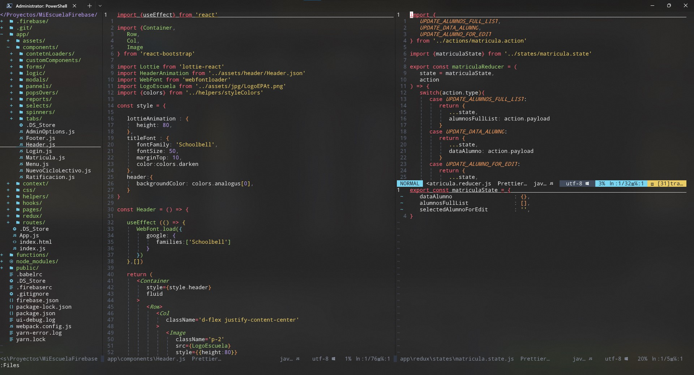

    *Terminal de nvim con código fuente, se puede apreciar como el texto debe ser ordenado a fines de facilitar su lectura, así como también los colores que se ven son el resultado de la herramienta que colorea palabras según un patrón para facilitar también su lectura.*  

    - Una terminal (Un terminal es un programa en sí mismo que viene en todos los sistemas operativos, se utiliza principalmente para leer y ejecutar comandos que el usuario envía mediante el teclado. Además, en desarrollo de software se vuelve esencial ya que a través de la terminal se leen problemas detectados al momento de ejecutar un software) 

    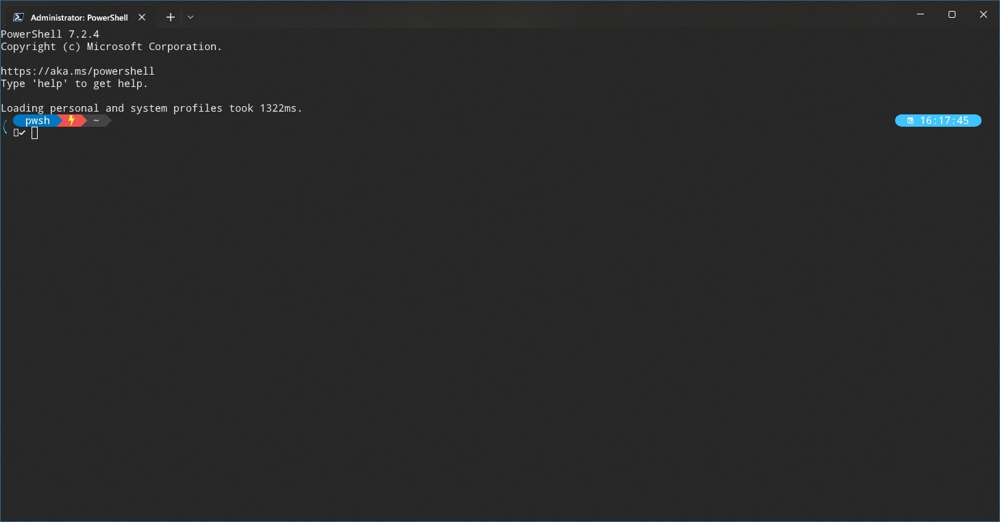

    *Una terminal vacía esperando un comando.*

    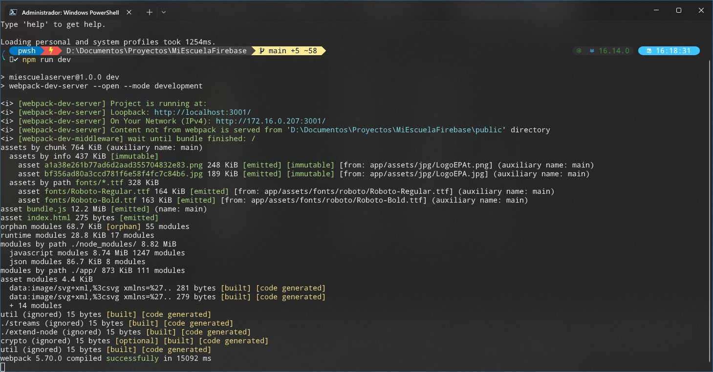

    *Una terminal con información en tiempo real de la ejecución de un software.* 

    - Un navegador web: Ya que esta aplicación estaba pensada para realizarse de entrada con acceso a internet era necesario programarla para que se ejecute en un navegador web. El más popular de todos es Google Chrome, pero también puede utilizarse otros como Mozilla Firefox, Internet Explorer, Edge, etc.

    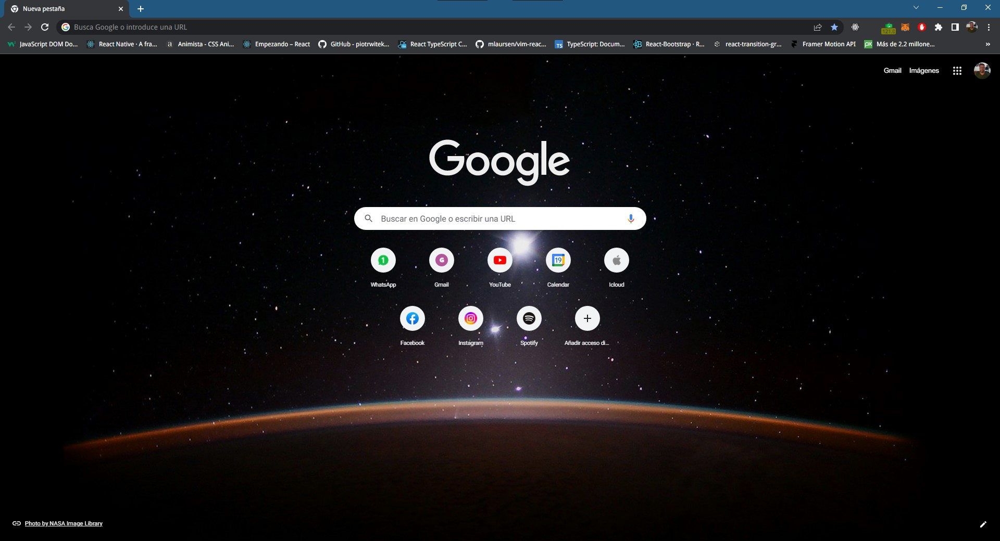

    *Una ventana de Chrome vacía*

    No solo se necesita el navegador, hay una herramienta que viene con todos los navegadores que se llama consola. En esta herramienta se muestra en formato de código todo lo que en ese navegador está pasando. Si tienen curiosidad abran cualquier página web que Uds. frecuenten y presionen la tecla f12 en su teclado. Automáticamente una consola se abre mostrando como lo que Uds. ven como resultado final debe ser escrito para que así sea.

    

    *Una consola de Chrome mostrando el contenido de una página*

#### Tecnologías

JavaScript, HTML, CSS, NeoVim, Chrome de por sí ya son tecnologías, así como un serrucho lo es también, sin embargo, una sierra eléctrica es una tecnología evolucionada que extiende la utilidad de la misma, la hace más funcional y lograr el mismo trabajo con mucho menor esfuerzo. Esto no es ajeno a las tecnologías en desarrollo, es por ello que como fruto de la búsqueda de la información se llegó a adoptar las siguientes tecnologías "evolucionadas" para realizar el proyecto.

- MongoDb (MongoDb es una base de datos especialmente diseñada para crear ámbitos modernos, escalables y sumamente potentes)

- Express (Es un framework [^framework]  especialmente diseñado para NodeJs el cual está pensado especialmente para crear aplicaciones web y APIs [^apis])

- NodeJs (Utiliza JavaScript para crear aplicaciones del lado del backend, tiene como principal objetivo ser multiplataforma y que tenga una gran escalabilidad. NodeJs se basa en el motor V8 de Google)

- React (React nace de la mano de un monstruo del campo. Fueron los ingenieros de Facebook los que crearon esta librería [^librería] que combina JavaScript, HTML y CSS en un solo archivo. React fue especialmente diseñado para la creación de Frontend y sus interfaces de usuario.)

De la combinación de estas 4 tecnologías si se toma la primera letra de cada una conforma un conjunto llamado MERN. Toda la aplicación se basa en la combinación de estas 4 tecnologías.

# Diseño 

La siguiente lista de pautas a cumplir fue la primera etapa del diseño. Donde se preguntó, cómo quiero que sea la aplicación.

- La aplicación será en primera medida diseñada para correr sobre un navegador web.
- Esta debe ser accedida a través de internet.
- Debe tener una seguridad por usuario y privilegios de acceso dentro de la aplicación.
- Debe encriptar las claves de usuario.
- Debe usar un token[^token] a fin de garantizar una seguridad óptima.
- Debe ser escalable.
- Debe ser modular.[^modular]
- Debe implementar el patrón REST.[^rest]
- Debe ser un servicio montado en la nube y no de forma local.
- Debe tener una interfaz de usuario simple y fácil de entender.

#### Mas tecnologías

Para poder garantizar los requerimientos del diseño se deben adoptar más tecnologías las cuales se nombran a continuación:

- Firebase: Firebase es un servicio de Google que permite la implementación de aplicaciones web tanto para el Frontend como para el Backend. Esto soluciona varios puntos. La aplicación puede ser accedida desde internet, es un servicio en la nube y este puede ser accedido por un navegador web.

- JWToken: Jason Web Token se utiliza para esconder información sensible y que esta no pueda ser alterada ya que posee una firma digital que se encuentra escondida en el backend y esta se compara cada vez que se manda una acción en la aplicación.

- Bcrypt: Bcrypt es un encriptador que se utiliza para que los usuarios una vez creada la clave, esta se encripta y no pueda volverse a su estado anterior. Para comprar 2 claves ambas deben de ser encriptadas a fin de saber si son coincidentes.

- Mongoose: Es un framework especializado para trabajar en conjunto con NodeJs y MongoDb. Simplifica el trabajo de realizar consultas a la base de datos.

- Bootstrap: Bootstrap es un framework creado por Twitter, fue pensado para crear el layout [^layout], especialmente pensado para que sea un diseño que se adapte a los diferentes tipos de pantalla y sus tamaños.

- React-Bootstrap: Es la implementación de Bootstrap pensado especialmente para el uso con React.

- Redux: Redux es un manejador de estado[^estado] que abstrae el estado de un componente para que este pueda ser accedido desde cualquier otro sin necesidad de pasar la información de padre a hijo[^padreahijo]. 

- React-Redux: Es la implementación de Redux especializada al uso con React.

### Etapas del proyecto

Para garantizar una forma de trabajo segura se determinaron las siguientes etapas, algunas de ellas ya están terminadas y otras deben ser creadas.

##### BackEnd

- Crear un servidor que maneje la seguridad, la conexión a la base de datos y la API.  
    - [x] Login.  
    - [x] Seguridad.
    - [x] Matrícula
    - [x] Usuarios.
    - [ ] Calificaciones.
    - [ ] Asistencia.
    - [ ] Reportes.
    - [ ] Informes.
    - [ ] Tutores.

- Crear una base de datos en MongoDb con su estructura y datos.
    - [x] Login.  
    - [x] Seguridad.
    - [x] Matrícula
    - [x] Usuarios.
    - [ ] Calificaciones.
    - [ ] Asistencia.
    - [ ] Reportes.
    - [ ] Informes.
    - [ ] Tutores.

- [x] Implementar el servidor en la nube para que la API pueda empezar a utilizarse.

##### FrontEnd

- [x] Crear el módulo de ingreso de los usuarios. (Módulo de login)

- [x] Crear el módulo de administración de usuarios, privilegios y claves. 

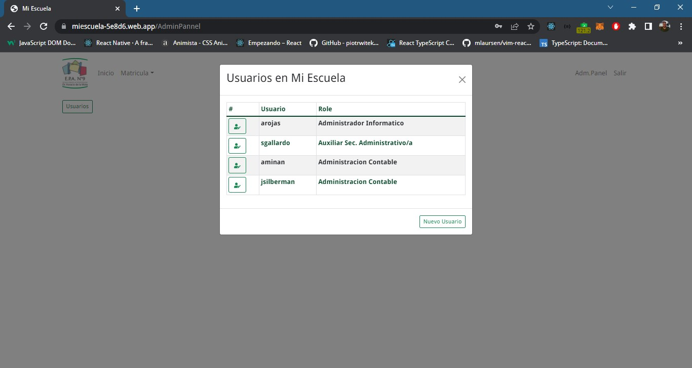

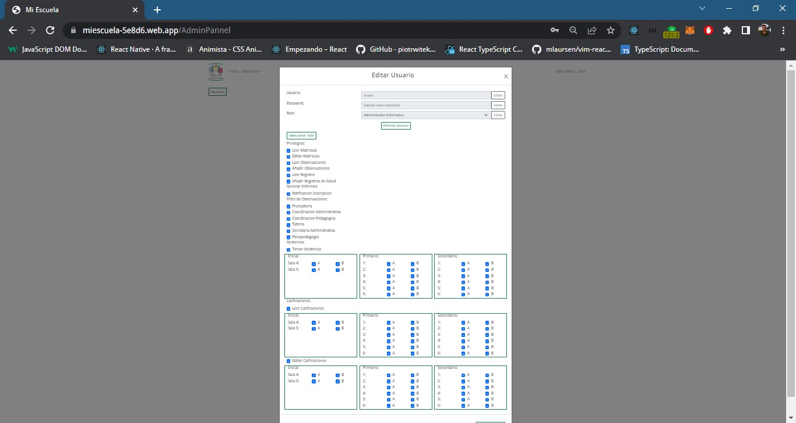

- [x] Crear el módulo de panel general. 

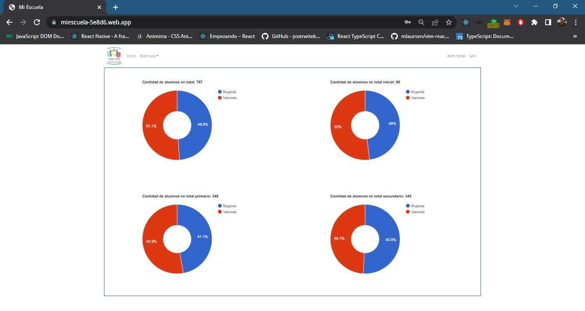

- [x] Crear el módulo de Matrícula. Con sus filtros y posibilidad de edición de datos.

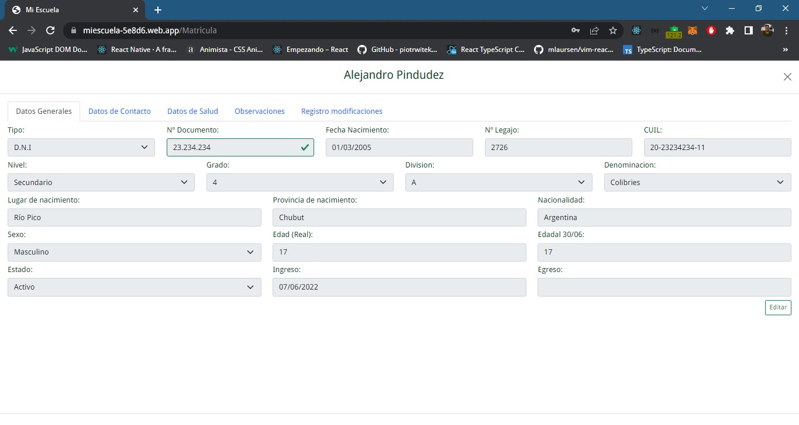

- [x] Crear el módulo de ingreso de nuevo alumno a la base de datos.

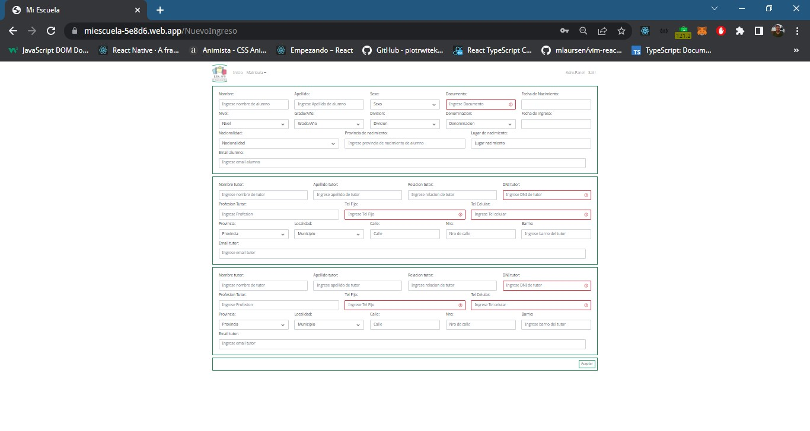

- [ ] Crear el módulo de legajos digitales.

- [ ] Crear el módulo de asistencia.

- [ ] Crear el módulo de calificaciones.

- [ ] Crear el módulo de reportes.

- [ ] Crear el módulo de informes.

- [ ] Adaptar el diseño para hacerlo compatible con pantallas chicas.

- [ ] Crear la versión móvil.

- [ ] Extender el acceso de la aplicación a los alumnos.

- [ ] Extender el acceso de la aplicación a los tutores.

- [ ] Adaptar el diseño para que pueda ser usado por varias instituciones educativas.

Como se puede ver aún falta mucho camino por delante, sin embargo ya está hecho un módulo totalmente funcional de la aplicación la cual puede ser accedida desde internet en la siguiente dirección.

https://miescuela-5e8d6.web.app/

Además el código fuente del proyecto está totalmente abierto a cualquiera que desee en la siguiente dirección.

https://github.com/alejandrorojasit/MiEscuela

Ahí se puede ver todo el código, la estructuras de carpetas y archivos del proyecto total.

# Ejecución

Antes de hablar de cómo se llevó a cabo paso a paso el proceso de creación del proyecto hay que hablar de unas últimas dos tecnologías que se utilizaron.

- Git: Es un software de control de versiones. Esto quiere decir que este software está grabando de forma permanente todos los cambios realizados en un proyecto de software para posteriormente llevar un control de todos sus cambios, así sean los más mínimos. Git además permite crear ramas diferentes, que son como 2 instancias del mismo proyecto que se separan y se trabaja de forma paralela en ellas, para posteriormente si es necesario volver a unirlas y mezclar los cambios realizados.

- Github: Si estás leyendo este proyecto estás en github. Github es una plataforma donde se pueden subir todos los trabajos que son vigilados por el sistema de Git. Además de eso es una comunidad abierta de programadores donde gente de todo el mundo comparte sus creaciones y experiencias. Es aquí en github donde se suben aquellas tecnologías que se nombraron con anterioridad con sus respectivos instructivos de uso. Github es una comunidad de código abierto que permite a cualquier persona tomar lo que ya está hecho y modificarlo a su gusto así como también está abierta a la colaboración de proyectos. Es por eso que una pequeña idea puede llegar a tener la colaboración de miles de usuarios y volverse una herramienta sumamente poderosa para toda la comunidad.

Volviendo al tema principal, si ingresan a la siguiente dirección, https://github.com/alejandrorojasit/MiEscuela podrán ver el código de todo el proyecto. 

Se puede destacar las siguientes secciones:

1. Nombre del usuario quien creó el repositorio[^repositorio] y el nombre del mismo.
2. La rama en la cual se está trabajando.
3. Número de identificación único del commit [^commit], seguido de cuando fue la última fecha de actualización del proyecto y por último la cantidad de commits que se realizaron en el proyecto.
4. El porcentaje de lenguajes con lo que está escrito el proyecto.
5. Las carpetas y archivos de todo el proyecto. Se puede ingresar a cada uno de ellos para ver el contenido de los diferentes archivos.

Aquí se puede ver una vista de un archivo con su respectivo código.

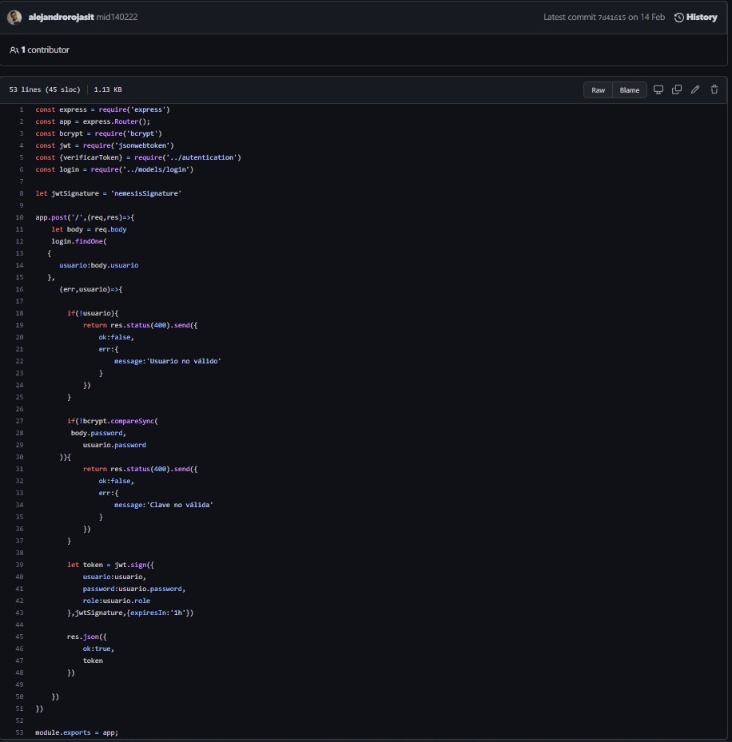

Pero esto nos lleva a la pregunta, ¿cómo podemos ver el proceso de cómo se creó el proyecto?. La respuesta nos lleva a la imagen donde se mencionan las secciones de github. En el apartado número 3 se menciona al número de identificación del commit y la cantidad de los mismos.

Si hacemos clic en ese pequeño reloj, nos lleva a un historial de todos los commits realizados con anterioridad.

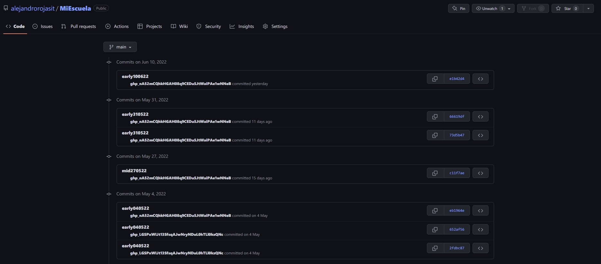

Los nombres de los mismos siguen un patrón early, mid o late se refiere al momento del día en que se realizaron, seguido por la fecha. En la parte inferior de toda esa lista se encuentra el primer commit que se realizó. Cuando se realizó este commit ya había mucho código escrito, git fue una tecnología que se empezó a usar en este proyecto mucho después de su comienzo. Fue parte del proceso de aprender sobre la marcha.

Aquí vemos un ejemplo de un detalle de un commit. En el margen izquierdo vemos todos los archivos que se modificaron desde el commit anterior al que estamos viendo. Luego en la parte derecha vemos el código en sí de dichos archivos. Nótese que en hay partes pintadas en verde y otras en rojo. Las verdes son secciones de código que se añadieron al archivo y las en rojo son secciones que se eliminaron. Además figura un resumen debajo del nombre de quien hizo el commit de cuántos archivos se modificaron, cuantas líneas se añadieron y cuantas se eliminaron.

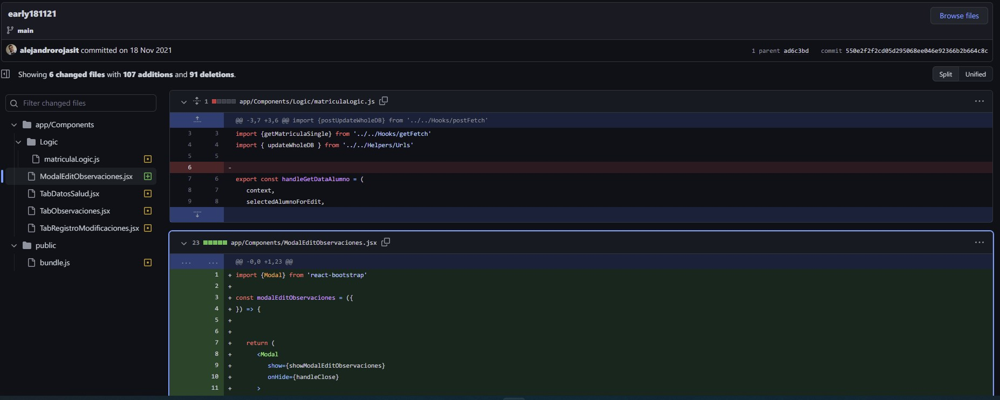

Esta es la historia paso a paso del proyecto, con todas sus características, aquí quedó registrado la evolución del mismo desde una edad muy temprana hasta hoy día. El proceso como mencione en la introducción fue arduo. Sin ir más lejos el último commit de fecha muy reciente early100622 muestra que se tuvieron que añadir 1719 líneas de código nuevo y borrar 1335. Esto en función de agregar una nueva tecnología que en ese caso fue Redux.

# Evaluación

Más que evaluar aquí se habla de evolución, la evolución es constante cada vez que se ingresa una letra de código. La incorporación de las tecnologías que se mencionaron con anterioridad fue paulatina, muchas veces fue planeada con tiempo y forma para que añadirlas sea un proceso suave, otras veces fue obligado tras chocar con un muro que impedía realizar las etapas de diseño anteriormente mencionadas. Esto lleva a que el proyecto evolucione, mute, sea totalmente flexible y crezca de la mano de quien lo desarrolló. 
Aún queda mucho trabajo por hacer, quizás años de trabajo para terminar todas las etapas del mismo. Sin embargo desde ese comienzo lleno de dudas puedo decir que alcanzó en esta primera etapa el propósito para el cual fue creado, dando una solución a un problema.

Existen cientos de cambios que se van a realizar en función de mejorar el proyecto, hay algunas en vista y otras que surgirán en el proceso. Añadir nuevas tecnologías, hacerse de buenos hábitos de trabajo y formas de escribir el código, etc. 

Espero que este proyecto siga creciendo hasta que llegue a cumplir su objetivo final, que es brindar un servicio gratuito a toda la comunidad educativa, en la que todas las escuelas puedan utilizar esta herramienta que será de distribución libre. Esta será la manera en la cual voy a devolver todo aquello que aprendí de quienes se tomaron el trabajo de compartir sus experiencias, sus creaciones,cursos, tutoriales, sin buscar en ello ganar dinero. Esta forma de pensar es muy común en el ámbito del desarrollo de software. La mayoría de la comunidad apoya la libre información y la masificación de la misma.

Gracias!

[^servidor]: Servidor (Un servidor es una computadora especializada para estar encendida las 24 hs y que esta pueda ser accedida desde una red local o por internet. Para hacerse una idea, cada vez que alguien quiere entrar a www.google.com.ar un servidor responde a esa solicitud enviando la información necesaria para que el usuario vea en su pantalla dicha página. Cuando el usuario realiza una búsqueda, es el servidor quien en primera medida recibe los parámetros de búsqueda y ejecuta la misma para posteriormente enviar los resultados al usuario y que éste los vea en pantalla.)  

[^software]: Software (Se refiere a todo programa, código, aplicación, que corre o se ejecuta en un equipo informático, ya sea, una computadora, celular o Tablet. Si bien el campo es más amplio a cuantos equipos posibles existe para que corra un software, solo nos limitaremos a computadoras, celular o tabletas) *El software es todo aquello que no es tangible, existe, pero no de forma física.*

[^hardware]: Hardware (Se refiere a todo componente físico que conforma un equipo informático, teclado, mouse, pantalla, parlantes, botones, etc.)

[^lenguaje]: Lenguaje (Cuando se habla de lenguaje de programación se hace referencia a cuál será el "idioma" que el desarrollador utilizará para darle indicaciones al equipo informático. Existen cientos de lenguajes diferentes, algunos generales y otros específicos, todos tienen sus ventajas y falencias.)

[^frontend]: Frontend (Hace referencia a la parte del software con la cual interactúa el usuario)

[^backend]: Backend (Hace referencia a la parte del software que está alojado en servidor, ejecuta y coordina como se va a entregar la información al Frontend, así como también maneja la seguridad)

[^operativo]: Sistema operativo (El sistema operativo es con lo primero que un usuario se encuentra al otilar un equipo informático, es en este sistema operativo que se ejecutan las aplicaciones o software, es el sistema operativo el encargado de realizar la unión entre software y hardware en caso de una computadora, este puede ser Windows o Linux, en caso de un teléfono puede ser Android, IOS -Para iPhone- o Windows Phone, para tabletas este puede ser Windows Mobile, Android o IOS)

[^plugin]: Plugin o complemento es una aplicación que permite extender el funcionamiento de otra aplicación. Sin tener que escribir código, es como pequeños ladrillos de plástico que se van uniendo para formar una estructura más compleja.

[^librería]: Una librería es un conjunto de funciones ya creadas de antemano que facilitan el trabajo de crear de cero las mismas, es decir, es un código ya escrito, probado y refinado que se puede reutilizar a criterio con el fin de acelerar la producción. 

[^framework]: Un framework no dista mucho de una librería, establece un marco de trabajo y herramientas ya creadas para facilitar la creación de contenido. La principal diferencia entre un framework y una biblioteca es que el framework está enmarcado, ya está hecho de una manera determinada y solo se puede usar lo que este contiene, mientras que una biblioteca no está ligada a nada, se pueden combinar infinitas bibliotecas sin importar quien las creó a fin de obtener el resultado deseado.

[^layout]: La palabra layout hace referencia a la manera de cómo los elementos que conforman una página web se disponen en el espacio en que se muestran.

[^apis]: Una API es una capa de abstracción de algo mucho más complejo que corre por detrás. Tomemos como ejemplo una casa de repuestos del automotor. Cuando vamos a comprar algo, no necesitamos saber dónde están los repuestos, de qué tipo son, cuanto salen, cuantos hay, etc. Esto lo sabe quién nos atiende en el mostrador, esta persona es la API, nos abstrae a nosotros como usuarios de saber cómo funciona lo que está por detrás, solo tenemos que saber dónde ir y cómo pedirlo.

[^modular]: Un diseño modular quiere decir que la aplicación se fragmenta en muchos componentes más chicos capaces de combinarse de muchas maneras sin necesidad de que uno dependa del otro. Un diseño modular implementa la idea de que cualquier módulo se puede reemplazar o modificar sin afectar al resto. Esto permite tener un mantenimiento más sencillo y una posibilidad de crecimiento óptimo.

[^rest]: REST es un patrón de diseño para la World Wide Web (www) en el cual se dictan pautas y modos de trabajo bien específicos a fin de obtener aplicaciones estandarizadas.

[^token]: Un token es una forma de esconder información, se toma una información sensible y se cambia por un algoritmo a algo sin sentido que luego puede ser devuelto a su estado original realizando el algoritmo en sentido contrario.

[^estado]: Un estado en una aplicación de React es como una fotografía de la aplicación en un momento dado, al cambiar algo por ejemplo llenar un formulario y hacer clic en un evento, un botón, por ejemplo, se vuelve a sacar otra fotografía de la aplicación en ese momento. Luego se comparan las 2 y solo se cambia en pantalla los objetos que tuvieron diferencia. Esto hace mucho más rápido el proceso que tener que enviar toda la página de nuevo desde el servidor y esperar que se cargue.

[^padreahijo]: Se conoce como pasar de padre a hijo cuando un módulo contiene otro en su interior. Para que el que está dentro acceda a la información de su módulo padre, este debe pasarle la información al hijo a fin de que esté disponible para ese. Esto plantea un problema cuando se tienen muchos hijos o niveles de anidamiento muy grandes en los cuales hay un ancestro común general , varios padres y varios hijos de cada uno y todos deben acceder a la misma información.

[^repositorio]: Se conoce como repositorio al espacio donde se puede ver un proyecto de software y su historial.

[^commit]: Un commit es una fotografía del proyecto en un momento dado, al realizar un commit uno compromete lo trabajado para que sea grabado finalmente por git y así poder llevar un seguimiento de lo realizado.

