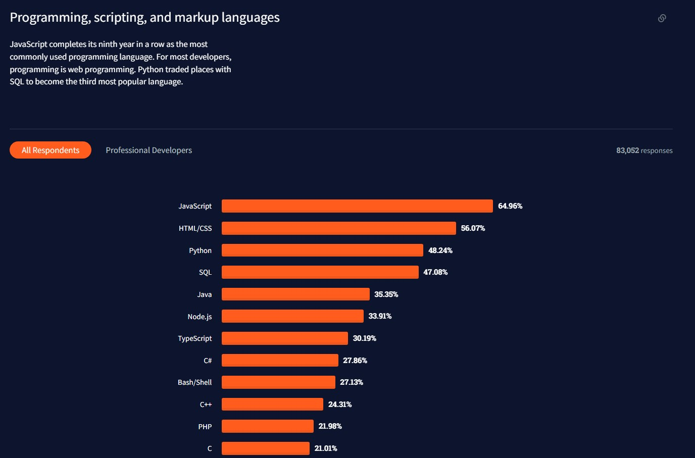
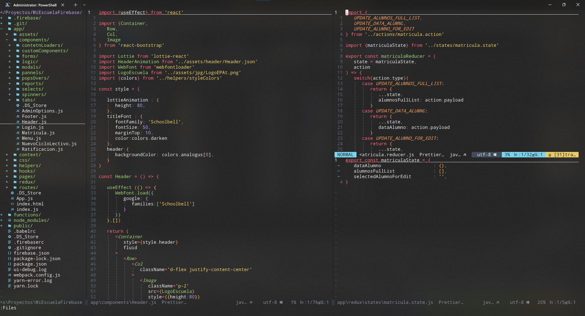
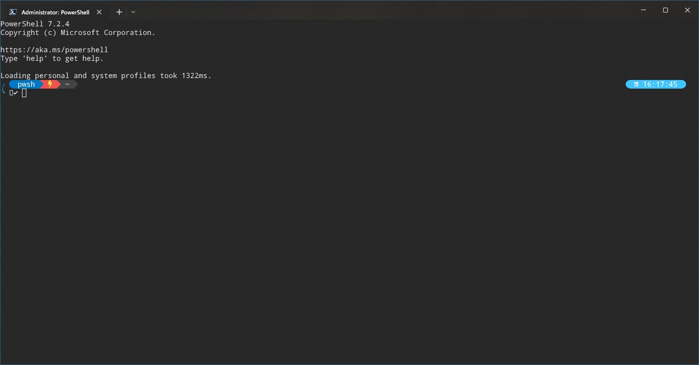
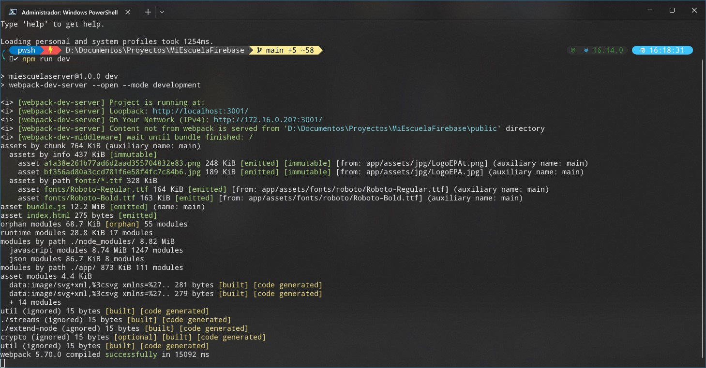
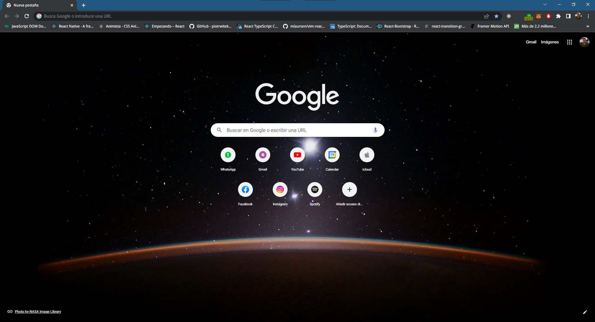
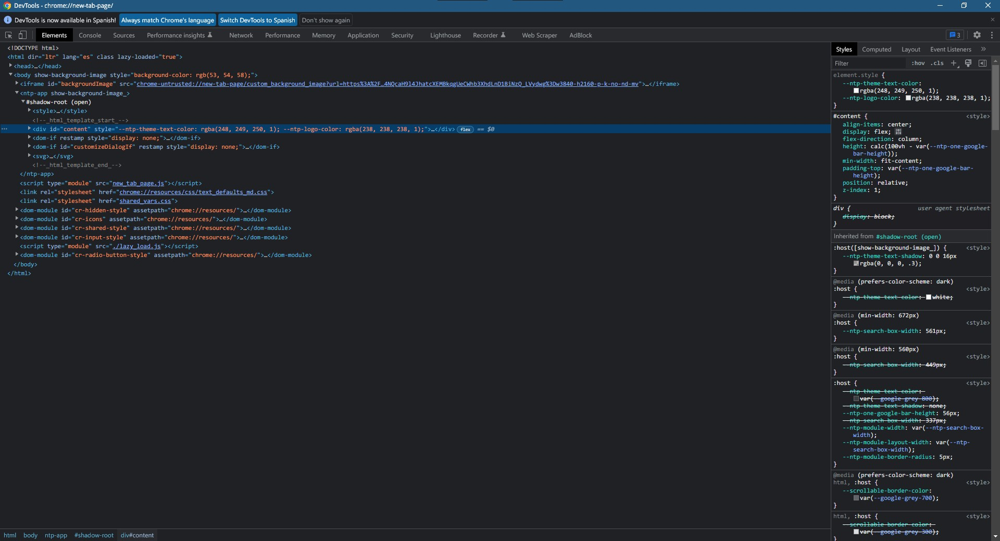

# Introduccion

Este proyecto surge no solo por el motivo que la materia presenta con el fin de poder presentar una solucion, ya sea un bien o un servicio ante un problema o necesidad. Sino como un conjunto de necesidades tanto de a quien va destinado el uso de proyecto, sino como tambien necesidades personales de quien lo desarrolla a fin de poder adquirir nuevas habilidades para poder crecer tanto personal como profesionalmente.  
Es asi como en el transcurso del desarrollo del proyecto, que comenzo desde cero, tanto en el uso de tecnicas asi como de conocimiento, fue un constante aprendizaje en el cual en muchas ocaciones se tuvo que reveer y replantear gran parte del mismo. A sido una experiencia ardua pero sumamente satisfactoria, plagada de situaciones en las cuales a modo de ejemplificar, cuando se creia llegar a la cima de la montaña se encontraba con picos aun mas altos que no estaban a primera vista.  
Asi fue como comenzo y continua mi odisea en el desarrollo de software. Espero que este proyecto no solo sirva como referencia de, sin importar que, aquello que deseamos se puede cumplir si trabajamos lo suficiente en ello, sino que ayude a quien no tenga ninguna experiencia ni conocimiento en el campo de desarrollo de software a poder lograr una idea basica de lo que este arte trata. 

### Una necesidad Personal

Los motivos personales de como comenzo este proyecto se remontan hace muchos años atras. Toda mi vida me dedique a la informatica, trabaje los ultimos 20 años en ella. Sin embargo el desarrollo de software siempre fue un gran pendiente en mi portafolio de habilidades. Nunca me hice de la *voluntad* para empezar a estudiar sobre ello por diferentes motivos. Fue asi hasta el año 2021 en el cual decidi dar un giro a mi carrera y empezar el camino hacia ser un desarrollador de software a tiempo completo.  
Fue ahi cuando en esa etapa tan temprana de no saber absolutamente nada empece a buscar en mi dia a dia una idea, de que poder crear, necesitaba tener metas fijas las cuales poder utilizar para aprender lo que era conveniente y no todo lo que existe ya que el campo del desarrollo de software es inmensamente amplio.Para poder llegar a mi mision, necesitaba un proyecto, el cual me llebara paso a paso a descubrir todas las etapas las cuales me iba a enfrentar.

> El desarrollo completo de este proyecto fue basado en la forma mas basica y mas potente que tiene cualquier persona de lograr sus objetivos.
>
> 1. Informarce.
> 2. Estudiar.
> 3. Aplicar.
> 4. ***Fallar***.
> 5. Corregir.
> 6. Controlar o mejorar.
> 7. Volver al paso 1.  

# Indentificacion del problema

Trabajo en una escuela desde hace mas de 10 años, en la cual mi actividad es la de mantener toda la infraestructura informatica. Eso contempla, computadoras de las diferentes areas, asi como tambien toda la estructura de red y los servidores asociados a ella. En este tiempo fueron muchos los problemas que surgieron, sin embargo hay uno puntualmente que nunca se le pudo dar solucion. Este problema se refiere al manejo de la informacion dentro de la escuela y la coordinacion de dicha informacion entre las diferentes areas.  

La informacion a la cual me refiero es la siguiente:

- Matricula de alumnos
- Calificaciones
- Asistencia
- Legajos
- Reportes de diferentes indoles
- Informes
- Estadisticas
- Actas y notas 

Esta informacion siempre fue manejada utilizando Excel y Word. Se detallara a continuacion cuales son los problemas y dificultades que el uso de estas tecnologias genera. Algunas son por una limitacion de tecnologia en si y otras por el factor de su complejidad de uso en ciertas circunstancias.

- Es sumamente dificil estandarizar nombres de archivos y locacion donde los mismos se guardan. Esto puede ser ya sea por omision del usuario de seguir estandar al guardar o escribir el nombre del archivo. O por error involuntario del mismo.
- Si bien tanto Excel como Word presentan la posibilidad de generar plantillas para que se intente tener para todos la misma estructura en la cual se muestra la informacion, es posible que ya sea por el error humano mencionado con anterioridad o un error de compatibilidad entre las diferentes versiones de Word o Excel instaladas en las diferentes maquinas (de bien de uso de la escuela asi como particulares) esta plantilla se "rompa" y termine siendo un verdadero dolor de cabeza corregir esos errores mas cuando el archivo ya fue cargado con informacion.
- Cuando la cantidad de informacion es muy grande, por ejemplo una matricula la cual cuenta con cientos o miles de entradas se corre un gran riesgo al utilizar esa informacion sobre un Excel. Algunos de los motivos se detallan a continuacion:  

  - Es posible modificar valores sin darse cuenta y guardarlos junto cambios realizados legitimos.
  - No se puede tener control de quien o cuando se cambio la informacion.
  - Lentitud en general, estas planillas son grandes y pesadas. El problema aumenta al trabajar con archivos en una red o mas aun cuando se trabaja con estos archivos por internet.
  - Uso de filtros complejo y poco amigable. Ademas los filtros pueden quedar guardados generando que quien abre despues la planilla no tenga toda la informacion disponible.

- No existen tecnologias que vengan ya con Excel y Word que hagan un respaldo de la informacion, esta debe ser aplicada de forma externa al mismo.
- Serias limitaciones de esta tecnologia para poder compartirlas a travez de internet. Este es un factor sumamente importante.
- Si bien en las planillas de Excel se pueden crear macros (codigo de programacion dentro de una planilla de excel) esta es sumamente lenta e inestable. Pude romperse el codigo con facilidad dejando la planilla inutil.
- Cuando las planillas de Excel aumentan en complejidad, las cuales tienen varias hojas y vinculos entre ellas se corre un gran riesgo de que se rompan los mismos dejando las planillas inutles.
- Corregir cualquier tipo de problema que tenga una planilla de Excel o incluso una simple tabla en Word lleva mucho tiempo.

De lo mencionado anteriormente se puede determinar que los problemas son los siguientes:

- Minimizar la posibilidad de falla humana.
- Falta de estandarizacion de una forma de trabajo .
- Falta de estandarizacion en la manera que se ingresan datos.
- Falta de control de quien puede o cuando cambio datos.
- Falta de un lugar unico donde toda los datos este disponibles y ordenados.
- Falta de accesibilidad de la informacion a travez de internet.
- Falta de preservacion de datos.

Como problemas secundarios se puede mencionar:

- Lentitud de la tecnologia.
- Lentitud al trabajar sobre la misma.
- Diconformidad de parte de usuario por fallas recurrentes.
- Desmotivacion.
- Se pierde mucho tiempo en corregir errores y fallas.

# Busqueda de informacion (primera parte)

Dentro de la informacion que se recaudo a fin de obtener una posible solucion se utilizo:

- Busquedas en general en internet, forosy blogs, buscando como poder mejorar la situacion utilizando en primera medida las herramietnas y tecnologias que ya estaban en uso.
- Consultas a otras instituciones para ver si alguna de ellas tenia una solucion digital ya funcionando. Ninguna de ellas contaba con una digitalizacion de su informacion, y de tener alguna estaban en la misma situacion, utilizaban Excel o Word.
- Busquedas en internet de software [^software] empaquetado (El software empaquetado es aquel que ya viene terminado y cerrado, no se pueden realizar cambios sobre el mismo, se debe utilizar como viene)
- Busquedas de proveedores de soluciones digitales de sofware empaquetado y a medida.
- Consultas a profesionales en desarrollo de software a fin de pedir presupuestos para la realizacion de un sofware a medida.

# Indentificacion de las soluciones 

Durante el transcurso de los años se intento incorporar otra tecnologia o metodos que dieran solucion a los problemas mencionados con anterioridad. De la busqueda de informacion se pusieron en juicio varias posibles soluciones, algunas de ellas fueron implementadas y otras descartadas de inmediato al analizar que no iban a poder ser implementadas. Las posibles soluciones las cuales cuales se detallan a continuacion y cuales fueron los motivos por los cuales fallaron.

- Capacitacion al personal para lograr estandarizar las formas de trabajo. FALLO (falta de predisposicion tanto de directivos como personal en recibir capacitacion)
- Generar carpetas donde guardar la informacion en los servidores [^servidor] y tener un espacio de trabajo unico. FALLO a medias (si bien el personal empezo a utilizar dicho espacio, no hubo forma de estandarizar la manera que lo hacia, guardaba o escribia la informacion.)
- Adquirir un software de gestion ya echo que se utilizara en otras instituciones educativas. FALLO (debido a la particularidad de la institucion hacia falta que el software tuviera un formato muy especifico)

Fue aqui, despues de agotar todas estas opciones cuando decidi plantear crear un software a medida, era la situacion ideal para poder crear mi propio proyecto, el mecionado anteriormente y poder satisfacer las necesidades de la institucion.

Dentro de las ventajas de que alguien que esta trabajando dentro de la institucion haga un software asi son:

- Conocimiento profundo de las necesidades institucionales.
- Conocer al personal.
- Comunicacion directa con los futuros usuarios.
- ***Acceso a la informacion ya echa con otras tecnologias y adaptarlas a una nueva.***
- Crear una aplicacion en conjunto desarrollador/usuario.
- Confianza.
- Sin costos extras.

# Busqueda de la informacion (segunda parte)

Una vez decidido que se iba a realizar un software a medida, y que iba a ser desarrollado por mi. Seguia buscar la mayor cantidad de informacion posible teniendo en cuenta los siguientes puntos:

- En que lenguaje [^lenguaje] se iba a realizar el desarrollo.
- Que herramientas se iban a utilizar.
- Cuales eran las tecnologias que se iban a asociar al lenguaje a fin de obtener los mejores resultados.
- Como iba a ser el diseño de la aplicacion.

Esta etapa fue bastante larga y en ciertos momentos abrumadora. Partiendo desde cero se vio en primera instancia que iba a ser un camino recto y facil de llevar a cabo, sin embargo con el correr de la investigacion se izo cada vez mas evidente de la enorme cantidad de informacion que habia por delante.  

#### El lenguaje

En primera medida habia que definir de forma clara que lenguaje se iba a utilizar. Como se menciono en la parte de palabras tecnicas, existen cientos de lenguajes diferentes. La busqueda de informacion hacerca de cual elegir se baso en los siguientes conceptos:

- Popularidad 
- Acceso a grandes fuentes de informacion de como utilizar el lenguaje. Ya sea documentacion oficial, foros, tutoriales en youtube.
- Una enorme y predispuesta comunidad. Todos los lenguajes tienen una comunidad de gente que esta dispuesta a brindar sus conocimientos y experiencias de forma abierta y gratuita. Esto es de vital importancia ya que se trataba de un proyecto indendiente.
- Que sea multiproposito (Tanto para crear el Frontend [^frontend] como el Backend [^backend])
- Que sea multiplataforma (Se refire a que se pueda ejecutar el software en cualquier tipo de pc, sin importar que sistema operativo [^operativo] tenga, o que tipo de dispositivo sea, computadora, celular o tablet)

Despues de una larga busqueda el lenguaje seleccionado y que cumplia todas estas pautas fue el llamado javascript. Javascript es un lenguaje el cual tiene una gran flexibilidad y es el lenguaje mas popular en la actualidad, segun la pagina www.stackoverflow.com el foro mas popular a nivel mundial de programacion.

Sin embargo un solo lenguaje no es suficiente para crear una aplicacion con todas las caracteristicas que este proyecto necesita. Ademas de javascript los lenguajes HTML y CSS son necesarios tambien para logar crear un Frontend que sea funcional e intuitivo.Cabe resaltar que HTML y CSS ocupan el segundo lugar de los lenguajes mas utilizados a nivel mundial.

#### Herramientas

Dentro de las herramientas hay que separar dos categorias:

- Herramienta fisica/hardware (Una computadora, cualquiera sea es suficiente, no hace falta una computadora especial para crear software y ni tiene que ser la mas potente o moderna, tampoco es necesario un sistema operativo especial, cualquiera sirve, el unico requerimiento es que tenga conexion a internet)

- Herramientas logicas/software (Uno de los motivos de por el cual se eligieron los lenguajes anteriormente mencionados fue que estos tienen la enorme flexibilidad de poder ser escritos literalmente en cualquier aplicacion de texto, es decir, se puede programar utilizando el bloc de notas de windows, o Word aunque sea muy ironico nombrarlo. Es decir, no es necesario una aplicacion especial para escribir el codigo. Sin embargo existen aplicaciones especializadas que ayudan al trabajo en gran medida.)  
Dentro de las herramientas que se van a utilizar se pueden mencionar:  

    - NeoVim (Un editor de codigo. Si bien su uso es complejo,ya que de entrada no viene con nada mas que la posilidad de escribir texto,y no se utiliza el mouse, todo debe realizarce con comandos de teclado. Cuenta con una enorme flexibilidad de poder adaptar el mismo al capricho del usuario volviendose una herramienta a medida muy poderosa y llena de plugins [^plugin] que se pueden instalar a fin de aumentar la productividad)  

    

    *Terminal de nvim con codigo fuente, se puede apreciar como el texto debe ser ordenado a fines de facilitar su lectura, asi como tambien los colores que se ven son el resultado de la herramienta que colorea palabras segun un patron para facilitar tambien su letura.*  

    - Una terminal (Un terminal es un programa en si mismo que viene en todos los sitemas operativos, se utiliza principalmente para leer y ejecutar comandos que el usuario envia mediante el teclado. Ademas en desarrollo de software se vuelve escencial ya que a travez de la terminal se leen problemas detectados al momento de ejecutar un software) 

    

    *Una terminal vacia esperando un comando.*

    

    *Una terminal con informacion en tiempo real de la ejecucion de un software.* 

    - Un navegador web: Ya que esta aplicacion estaba pensada para realizarse de entrada con acceso a internet era necesario programarla para que se ejecute en un navegador web. El mas popular de todos es Google Chrome, pero tambien puede utilizarce otros como Mozilla Firefox, Internet Explorer, Edge, etc.

    

    *Una ventana de chrome vacia*

    No solo se necesita el navegador, hay una herrmienta que viene con todos los navegadores que se llama consola. En esta herramienta se muestra en formato de codigo todo lo que en ese navegador esta pasando. Si tiene curisidad abran cualquier pagina web que uds frecuenten y presionen la tecla f12 en su teclado. Automaticamente una consola se abre mostrando como lo que uds ven como resultado final debe ser escrito para que asi sea.

    

    *Una consola de chrome mostrando el contenido de una pagina*

#### Tecnologias

[^servidor]: Servidor (Un servidor es una computadora especializada para estar encendida las 24 hs y que esta pueda ser accedida desde una red local o por internet. Para hacerse una idea, cada vez que alguien quiere entrar a www.google.com.ar un servidor responde a esa solicitud envidando la informacion necesaria para que el usuario vea en su pantalla dicha pagina. Cuando el usuario realiza una busqueda, es el servidor quien en primera medida recibe los parametros de busqueda y ejecuta la misma para posteriormente enviar los resultados al usuario y que este los vea en pantalla.)  
[^software]: Software (Se refiere a todo programa, codigo, aplicacion, que corre o se ejecuta en un equipo informatico, ya sea, una computadora, celular o tablet. Si bien el campo es mas amplio a cuantos equipos posibles existe para que corra un software, solo nos limitaremos a computadoras,celular o tablets) *El software es todo aquello que no es tangible, existe pero no de forma fisica.*
[^hardware]: Hardware (Se refiere a todo componente fisico que conforma un equipo informatico, teclado, mouse, pantalla, parlantes, botones, etc)
[^lenguaje]: Lenguaje (Cuando se habla de lenguaje de programacion se hace referencia a cual sera el "idioma" que el desarrollador utilizara para darle indicaciones al equipo informatico. Existe cientos de lenguajes diferentes, algunos generales y otros especificos, todos tienen sus ventajas y falencias.)
[^frontend]: Frontend (Hace referencia a la parte del software con la cual interactua el usuario)
[^backend]: Backend (Hace referencia a la parte del software que esta alojado en servidor, ejecuta y coordina como se va a entregar la informacion al Frontend, asi como tambien maneja la seguridad)
[^operativo]: Sistema operativo (El sistema operativo es con lo primero que un usuario se encuentra al utilar un equipo informatico,es en este sistema opeartivo que se ejecutan las aplicaciones o software, es el sistema opeartivo el encargado de realizar la union entre software y hardware en caso de una computadora, este puede ser Windows o Linux, en caso de un telefono puede ser Android, IOs -Para iphones- o Windows Phone, para tablets este puede ser Windows Mobile,Android o IOs)
[^plugin]: Plugin o complemento es una aplicacion que permite extender el funcionamiento de otra aplicacion. Sin tener que escribir codigo, es como pequeños ladrillos de plastico que se van uniendo para formar una estructura mas compleja.

